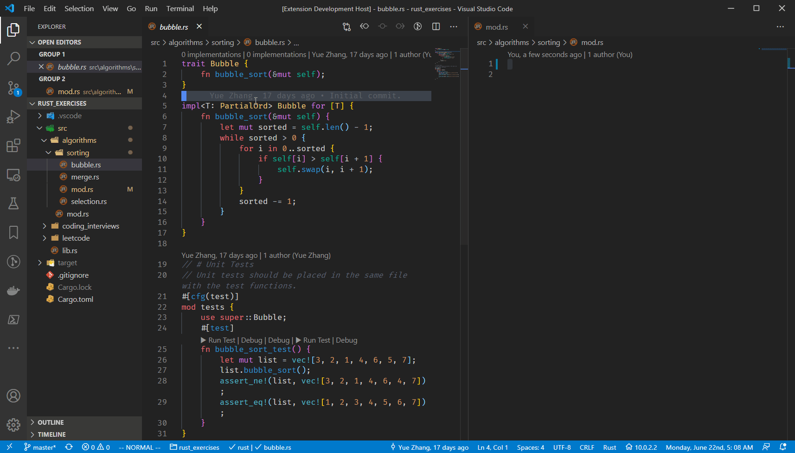
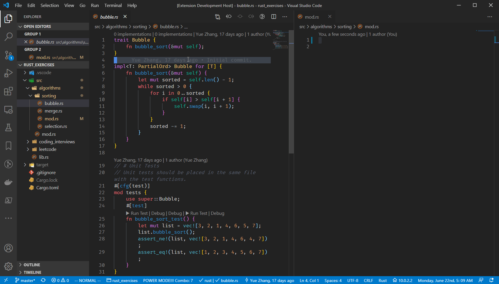
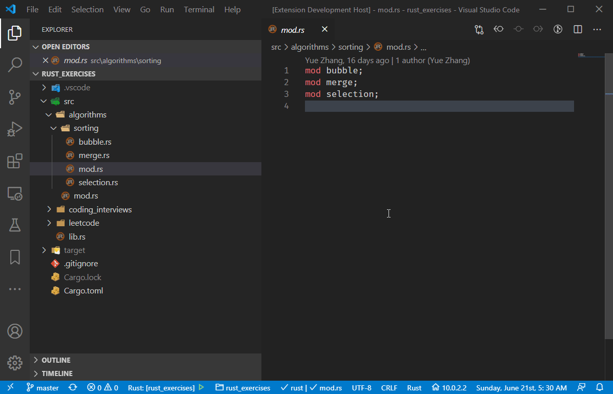

# Rust Mod Generator

Use this extension to generate a rust mod quickly.

## Features

### Create a rust module from the Explorer.

_Note_: The folder/directory has to contain either a "mod.rs" or a "lib.rs" file.

### Create a rust module from the command.

_Note_: A `.rs` file has to be focused on, such that the extension can determine the path of the new mod.

## Requirements

None.

## Extension Settings

This extension contributes the following settings:

- `rust-mod-generator.autoFocus`: Enable to auto focus on the new created module.
- `rust-mod-generator.selectAccessModifier`: Enable to set the access modifier when creating a new module.
- `rust-mod-generator.addModDeclaration`: Enable to prepend `<modifier> mod <mod_name>;` to a resource file.

## Known Issues
Welcome to post any issue.
