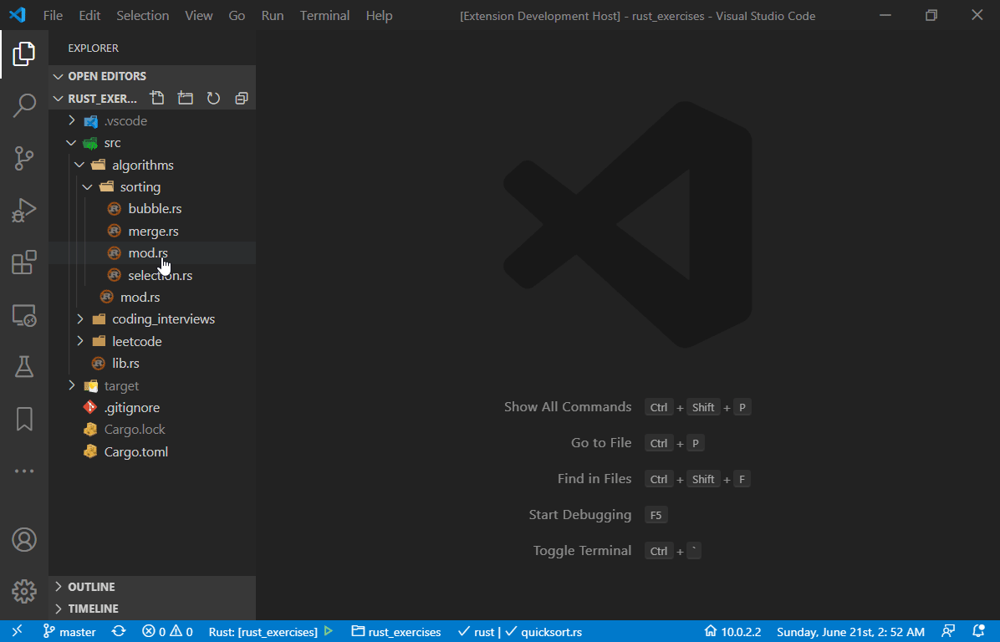
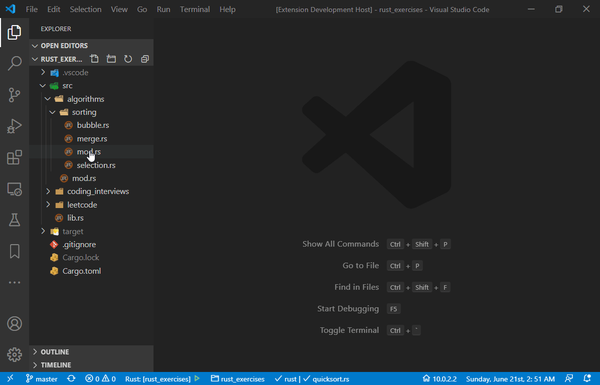

# Rust Mod Generator
Use this extension to generate a rust mod quickly.

## Features
### Create a rust module from the Explorer.

### Create a rust module from the command. A `.rs` file has to be focused on.

## Requirements
None.

## Extension Settings
This extension contributes the following settings in the future version:
* `rust-mod-generator.autoFocus`: Enable/disable auto focus on the new created module.

## Known Issues
Welcome to post any issue.

## Release Notes

### 0.0.1

- Initial release of Rust Mod Generator.

### 0.0.2 
- Add a logo.

### 0.0.3 (Current version)
- Add an extension setting `rust-mod-generator.autoFocus`.

### 0.0.4 (Next version)
- Allow to select the access modifier.
- Add `<modifier> mod <mod_name>;` automatically to the head of the resource file.
- Add an extension setting `rust-mod-generator.addModDeclaration`.